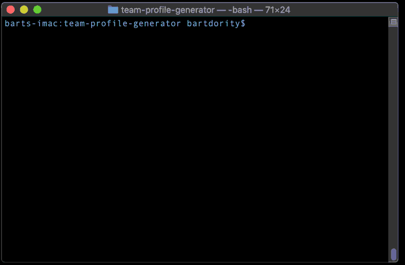

# Employee Summary
## Template Engine

A Node CLI that takes in information about employees for a project and generates an HTML webpage that displays summaries for each person. The user can input any number of team members, and they may be a mix of managers, engineers and interns.
When the user has completed building the team, the application will create an HTML file that displays a nicely formatted team roster based on the information provided by the user, and output this to a file: output/team.html




# Table of contents
1. [Usage](#Usage)
2. [Live Demo](#Live_Demo)
3. [User Story](#User_Story)
4. [Features](#Features)
   - [User Input](#User_Input)
   - [Roster Output](#Roster_Output)
5. [Technology](#Technology)
6. [Tests](#Tests)
7. [License](#License)
8. [Credits](#Credits)
9. [Badges](#Badges)

<a name="Usage"></a>
## Usage
```sh
node app.js
```
<a name="Live_Demo"></a>
## Live Demo
<a href="index.html">View the actual HTML output page</a>

<a name="User_Story"></a>
## User Story
```
As a manager
I want to generate a webpage that displays my team's basic info
so that I have quick access to emails and GitHub profiles
```

*This follows the [common templates for user stories](https://en.wikipedia.org/wiki/User_story#Common_templates), we can frame this challenge as follows:*


<!-- ### Classes
The project must have the these classes: `Employee`, `Manager`, `Engineer`,
`Intern`. The tests for these classes in the `tests` directory must all pass.

The first class is an `Employee` parent class with the following properties and
methods:

  * name
  * id
  * email
  * getName()
  * getId()
  * getEmail()
  * getRole() // Returns 'Employee'

The other three classes will extend `Employee`. 

In addition to `Employee`'s properties and methods, `Manager` will also have:

  * officeNumber

  * getRole() // Overridden to return 'Manager'

In addition to `Employee`'s properties and methods, `Engineer` will also have:

  * github  // GitHub username

  * getGithub()

  * getRole() // Overridden to return 'Engineer'

In addition to `Employee`'s properties and methods, `Intern` will also have:

  * school 

  * getSchool()

  * getRole() // Overridden to return 'Intern' -->

<a name="Features"></a>
## Features
1. accepts project title as user input
2. can accept any number of employees
3. includes custom attributes based on employee type
4. includes custom styling for each type of employee (manager, engineer, or intern)

### Template files

* There are multiple HTML templates - one for each type of employee

  * `main.html`
  * `engineer.html`
  * `intern.html`
  * `manager.html`

* The different employee types all inherit some methods and properties from a base class of `Employee`.

<a name="User_Input"></a>

### User input

The application prompts the user to build an engineering team. 
An engineering team consists of a manager, 
and any number of engineers and interns.

<a name="Roster_Output"></a>

### Roster output

The project generates a `team.html` page in the `output` directory, that displays a nicely formatted team roster. Each team member displays the following in no particular order:
  * Name
  * Role
  * ID
  * Role-specific property (School, link to GitHub profile, or office number)


<!-- ## Bonus

* Use validation to ensure that the information provided is in the proper expected format.

* Add the application to your portfolio. -->


<a name="Technology"></a>
## Technology
Node JS
npm package: Inquirer
Jest (for Testing)

The directory structure:
```
lib/           // classes and helper code
output/        // rendered output
templates/     // HTML template(s)
test/          // jest tests
  Employee.test.js
  Engineer.test.js
  Intern.test.js
  Manager.test.js
app.js         // Runs the application
```


<a name="Tests"></a>
## Testing
passed unit test: Employee.test.js, Engineer.test.js, Intern.test.js, and Manager.test.js


<a name='License'></a>
## License
[](https://lbesson.mit-license.org/)


<a name="Credits"></a>
## Credits
b0rgBart3@gmail.com

<a name="Badges"></a>
## Badges
 [](https://shields.io/)

**on github:** <a href='github.com/b0rgBart3'>b0rgBart3</a>

[](https://github.com/remarkablemark)

Email: borgBart3@gmail.com
